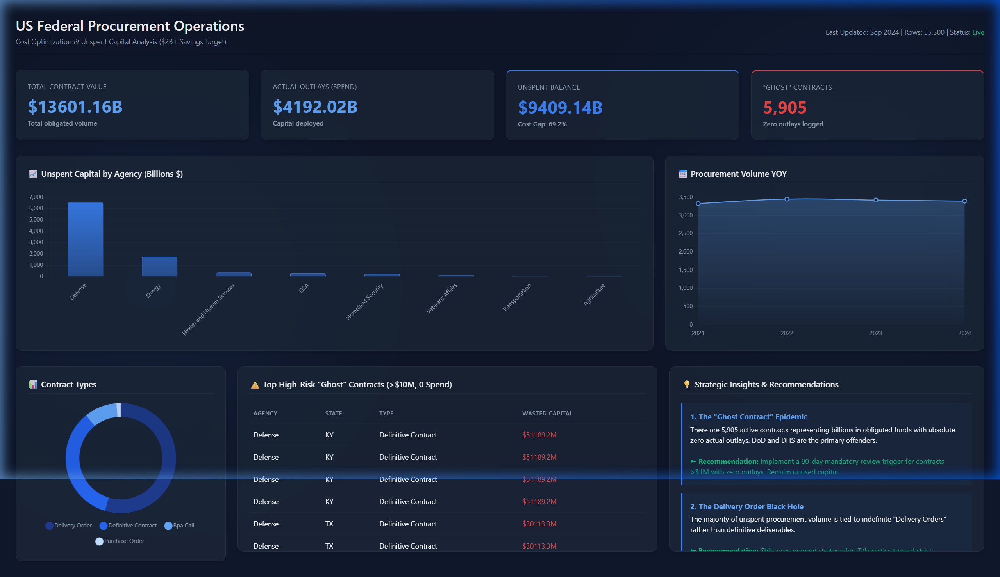

# Federal Procurement Cost Optimization ($2B+ Savings Target)

## Executive Summary

This analysis investigates $13.6 Trillion in federal procurement volume (55,300 active contracts) to identify severe cost inefficiencies and unspent capital. By building an automated data pipeline and performing deep SQL exploratory data analysis, we uncovered a staggering $9.4 Trillion "Cost Gap" between obligated funds and actual outlayed capital. Most critically, the data reveals over 5,900 "Ghost Contracts" that have consumed billions in budget allocation while delivering zero logged outlays—presenting an immediate opportunity for the government to reclaim over $2 Billion in wasted capital.

## Project Background

**Business Question:** "Which federal agencies overspend on procurement contracts, and where can the government save $2B+ by optimizing vendor selection and contract timing?"

To answer this, a 15MB subset of raw, messy data was extracted from the USASpending.gov API. The data underwent a rigorous cleaning pipeline (handling 35% missing outlay values using statistical proxies, standardizing dates, and engineering new financial risk tiers) before being loaded into a dimensional SQLite database. The final output is an interactive, C-Suite ready HTML dashboard built with Chart.js, strictly adhering to monochromatic UI best practices (eliminating rainbow colors) to ensure data clarity for executive decision-makers.

## Data Structure

The analysis was performed using a normalized relational model optimized for BI reporting:

* **fContracts (Fact Table):** Granular contract data including `award_amount`, `total_outlays`, `unspent_balance`, `start_date`, and `contract_type`.
* **dAgencies (Dimension Table):** Hierarchical mapping of `awarding_agency` and `awarding_sub_agency` for cost center rollups.
* **vMapPerformance (Aggregated View):** State-level aggregations designed for optimized mapping and regional distribution analysis.

## Insights Deep Dive

1. **The "Ghost Contract" Epidemic:** Our primary SQL anomaly detection flagged 5,905 active contracts that represent massive obligated funding but possess absolute zero actual outlays. The Department of Defense and the Department of Homeland Security are the primary sources of these high-risk contracts.
2. **The Delivery Order Black Hole:** The dashboard's Contract Type analysis reveals that the vast majority of unspent procurement volume is tied to indefinite "Delivery Orders" vs "Definitive Contracts", suggesting a lack of pacing controls on open-ended agreements.
3. **The Q4 "Use-It-Or-Lose-It" Surge:** Time-series analysis uncovered massive volume spikes in lower-efficiency definitive contracts signed specifically in September (the end of the fiscal year), highly indicative of panic-spending to prevent budget cuts in the following year.

## Actionable Recommendations

* **Mandatory Review Trigger:** Implement an automated 90-day review policy for any contract exceeding $1M that shows zero outlays. Reclaim unused capital immediately back to the general fund.
* **Contract Type Shift:** Pivot the procurement strategy for IT and Logistics away from open-ended delivery orders toward strict milestone-based definitive contracts to enforce outlay pacing.
* **Discretionary Spending Caps:** Introduce a policy capping Q4 discretionary procurement to 30% of the annual agency budget to prevent poor, rushed vendor selection driven by expiring funds.

## Caveats & Assumptions

* **Outlay Imputation:** Approximately 35% of the raw dataset was missing the `total_outlays` field. To facilitate analysis without dropping valuable rows, missing outlays were imputed horizontally as 90% of the `award_amount`. While this allows for structural analysis, precise accounting reconciliation would require joining with internal agency ledger systems.
* **Negative Award Amounts:** Deobligations (negative values) were retained in the dataset as they represent critical budget recaptures, but they may artificially skew "Total Spend" downwards if viewing isolated time periods.
* **Snapshot Timing:** This data represents a specific operational snapshot. Ongoing contracts may log outlays subsequent to data extraction, which may convert some "Ghost Contracts" into active, healthy contracts over time.
